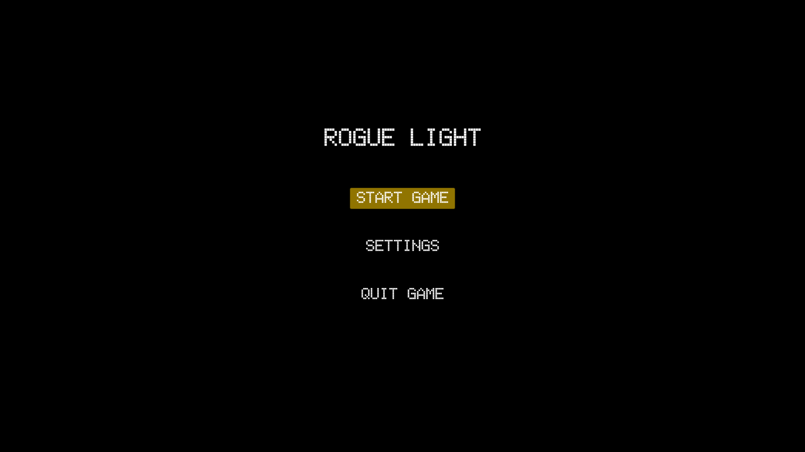
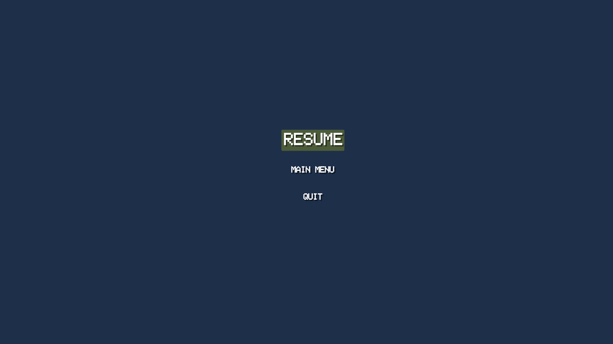
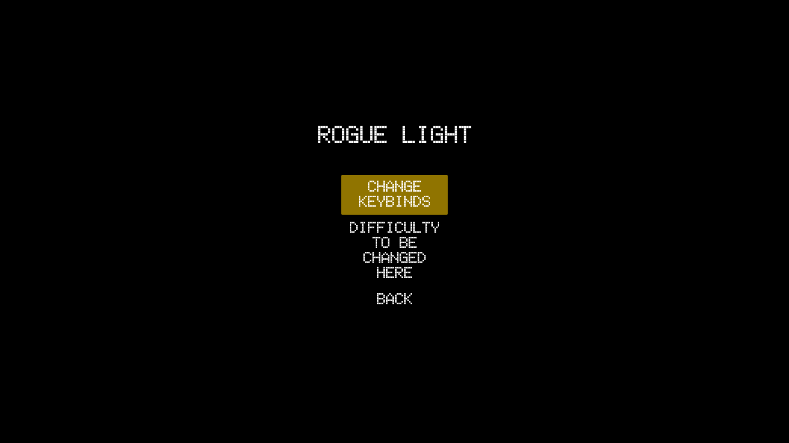

# README

Evan Colwell
Gavin Horner
Jeremy Johnson 

A unity project for CS491 Software Engineering with Gavin Horner and Jeremy Johnson
RogueLight is a game application in the style of an RPG rogue like game that is meant to entertain a single user.

## AUTHOR

Evan Colwell: ec-colwell@wiu.edu
Gavin Horner: gd-horner@wiu.edu
Jeremy Johnson: jc-johnson9@wiu.edu

## USAGE

Choose between Starting the game, changing the settings or quitting the application. If the game is started, the user will see a new screen. Press the "p" key to open the pause menu. Press resume to return to the current screen, main menu to return to the main menu and quit to exit the application.

First, unzip Build.Zip and then find the Rogue_Light.exe application and run it, or find the following in your path:

C:\path\to\build\Rogue_Light.exe

## ABOUT

The programs purpose is to entertain the user through game play. 

- MainMenu
- SettingsMenu
- PauseMenu

## SCREENSHOTS

Here are a few screenshots of the working game, with it's UI for Phase II of the project.

